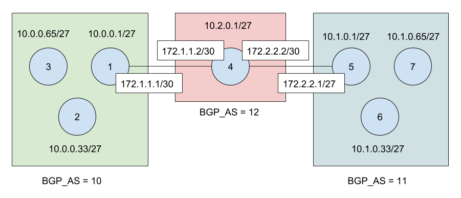

# Temba

One liner definition: erb templates on config files per device (some files are shared) evaluated from inherited yaml files with two interfaces: rake and rubyonrails form.

Buildsystem to generate custom Openwrt-Firmware files for different nodes in a community network.

At the moment this is serving postqMp community with bmx6 (note that VLAN 12 on ethernet is untagged)

If you want to control the build system my recomendation is to use [lime-sdk](https://github.com/libremesh/lime-sdk). [Instructions](https://github.com/guifi-exo/wiki/blob/master/howto/lime-sdk.md)

## Status

### General

Work in progress

- with official openwrt should work by default, just `rake`
- with custom firmware requires manual operations and the documentation is not clean/finished

### Device status

- regular-nanostation-m5

    - [x] template
    - [x] tested
    - [x] in production
        - 10.1.58.65 with temba commit d4f4256
        - 10.1.56.161
        - 10.1.57.33
        - 10.1.57.225
        - etc.

- regular-nanostation-m5-xw

    - note: template is based on a node running in production (10.1.71.97)
    - [x] template
    - [x] tested
    - [x] in production
      - 10.1.57.193
      - 10.1.58.161

- regular-nanostation-loco-m5-xw

    - note: template is based on a node running in production (10.1.73.65)
    - [x] template
    - [x] tested

- regular-rocket-m5-xw

    - note: template is based on a node running in production (10.1.72.1)
        - observeu que en el cas de la Rocket, he afegit una nova iface WAN per connectar a un router ADSL (per exemple) a través d'una VLAN
    - [ ] template
    - [ ] tested

- border-nanostation-m5-xw

    - note: template is based on a node running in production (strange bgp: 10.1.66.161, normal bgp: 10.1.71.161)
    - [x] template
    - [ ] tested

## Motivation

Device configuration should be:

* Consistent / [DRY](https://en.wikipedia.org/wiki/Don%27t_repeat_yourself)
* Revertible - especially using `first_boot`
* Under version control

To archive these goals, a OpenWRT-configuration is generated based on Ruby `.erb` templates. A dedicated firmware file is generated for each node.

## Structure

To avoid redundancy of information we use different yaml files, you can test yaml stuff through this online app http://yaml-online-parser.appspot.com/ and here is the source code https://github.com/ptarjan/online-yaml-parser/tree/master

* `10-globals.yml` - default variables that are generic for a specific community network like DNS or NTP server, what kind of Image Builder you want to use, and other default options you want to apply to your devices or nodes.
* `20-devices.yml` - default variables that are part of a device like its packages, architecture
* `30-nodes.yml` - inventory of all nodes. A firmware-file is generated per node. You probably don't want to share this file because contains sensitive information like IP, geolocalization of node, etc.
* `files` - Directory that contains all template config files
  - `template__` - Directories with their specific .ERB-templates. After processing all ERB-templates, it is integrated into the firmware files
  - `notemplate__` - Directories with inmutable configuration that is integrated into the firmware files. This could be transitory until some generalization and templating is available for the target.
* `output` - Output folder for files and directories generated with this tool
* `Rakefile` - Central build file

## Requirements

assuming debian 9

    sudo gem install bundle

ruby on rails

nokogiri dependencies

    apt-get install build-essential patch ruby-dev zlib1g-dev liblzma-dev

install nokogiri as a gem (because bundler has problems)

    gem install nokogiri

nodejs

    apt-get install build-essential patch ruby-dev zlib1g-dev liblzma-dev

the rest

    sudo apt install ruby-dev
    sudo gem install rails

install dependencies

    bundle install

## Usage

1. Adapt yml files (you have 2 examples you can rename files or create on your own)
2. Adapt templates accordingly. They start with `template__`. `template__common` is a directory to share common files across different devices through relative symlinks
3. Run
    - `rake` if you want to generate firmwares
    - `rake debug` if you want to debug only templates

### 20-devices.yml

in root of buildroot file `.config` gives you details of variables used in yaml file

| variable in .config | variable in 20-devices.yml |
| ------------------- | -------------------------- |
| CONFIG_TARGET_PROFILE | profile |
| CONFIG_TARGET_BOARD | platform |
| CONFIG_TARGET_SUBTARGET | platform_type |

alternatively use `cooker` as described in [lime-sdk](https://gitlab.com/guifi-exo/wiki/blob/master/howto/lime-sdk.md#qa)

## Run x86_64 in qemu

    qemu-system-x86_64 -M q35 -drive file=bin/hostname-x86_64-combined-ext4.img,id=d0,if=none,bus=0,unit=0 -device ide-hd,drive=d0,bus=ide.0

src https://openwrt.org/docs/guide-user/virtualization/qemu#openwrt_in_qemu_x86-64

## Testbed

Temba facilitates the creation of testbed to improve the network. `tb` refers to be used in a testbed

The images of the following diagram can be generated running `31-testbed-nodes.yml.example`. With that images you can run [temba-qemunet](https://gitlab.com/guifi-exo/temba-qemunet) with a particular topology to run the testbed. Green (left) and blue (right) squares represent bmx6 mesh networks and red square is a bgp zone where routes are propagated . This is a common scenario in Barcelona.

More details to come

## Notation & coding style

wifN means wireless N=0,1,2,...

cifN means cable N=0,1,2,...

instead of tab, configurations are indented by 2 spaces (as in [GNU style](https://en.wikipedia.org/wiki/Indentation_style#GNU_style))

## Invisible credits

Sometimes the commits are not done by the original authors

@dyangol provided great help contributing with templates, configurations, bugfix and reviewing ideas here implemented

The original idea is from [@yanosz](https://github.com/yanosz) and its repository https://github.com/yanosz/mesh_testbed_generator

The inspiration to do the ruby on rails form app comes from chef.libremesh.org, thanks [@aparcar](https://github.com/aparcar)

## Similar projects

- https://chef.libremesh.org
- https://github.com/yanosz/mesh_testbed_generator
- https://github.com/openwisp/ansible-openwisp2-imagegenerator
- https://chef.altermundi.net
